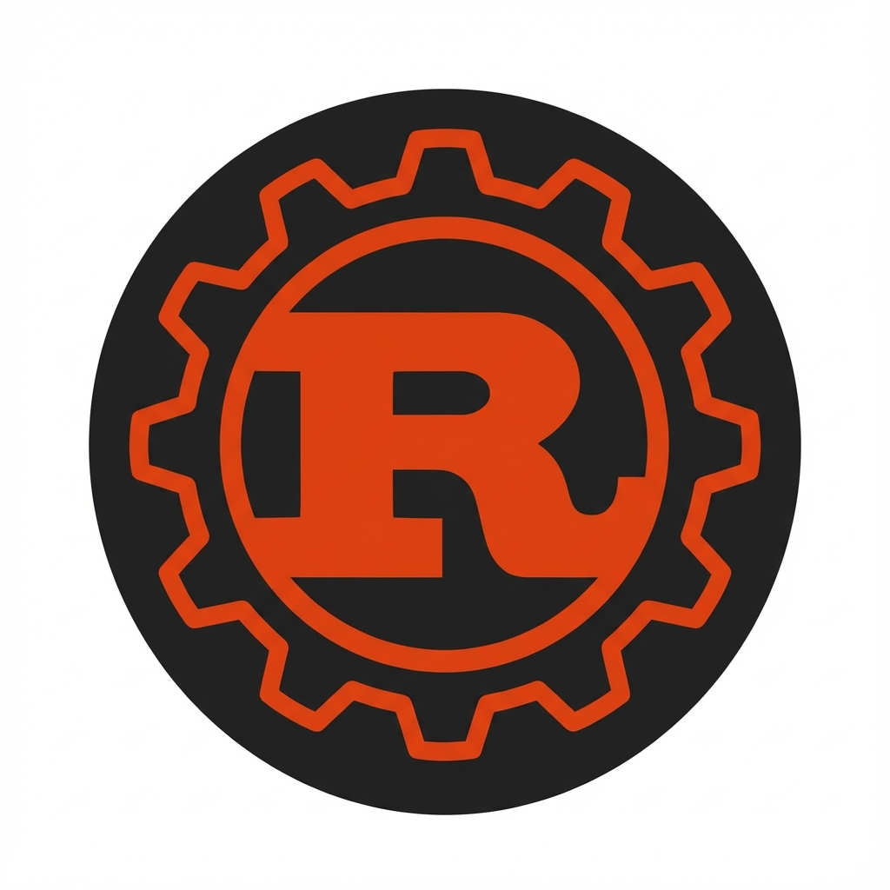

# Rust Documentation - Raycast Extension

A powerful [Raycast](https://www.raycast.com/) extension that lets you search and browse the Rust Standard Library documentation directly from your command bar.



## Features

- 🔍 **Fast Search**: Quickly search through the entire Rust Standard Library
- 📚 **Comprehensive Coverage**: Includes items from `std`, `core`, and `alloc` crates
- 🎯 **Smart Filtering**: Intelligent search ranking that prioritizes exact and prefix matches
- 🎨 **Visual Type Indicators**: Color-coded icons for different Rust types (structs, enums, traits, functions, etc.)
- 📖 **Inline Documentation**: View formatted documentation directly in Raycast without opening a browser
- 🔗 **Quick Actions**: Copy paths, URLs, or open documentation in your browser

## Supported Types

The extension recognizes and displays the following Rust documentation types with unique icons and colors:

- **Structs** (Box icon, Blue)
- **Enums** (Tag icon, Orange)
- **Functions** (Code icon, Green)
- **Traits** (Circle icon, Magenta)
- **Primitives** (Globe icon, Red)
- **Macros** (Hashtag icon, Purple)
- **Modules** (Folder icon, Yellow)
- **Constants** (Hashtag icon)
- **Type Aliases**
- **Keywords**
- **Unions**
- **Attributes**
- **Derive Macros**

## Installation

### From Raycast Store (Coming Soon)

Search for "Rust Documentation" in the Raycast Store and click Install.

### Manual Installation

1. Clone this repository:
   ```bash
   git clone https://github.com/0xOse/raycast-rust-extension.git
   cd raycast-rust-extension
   ```

2. Install dependencies:
   ```bash
   npm install
   ```

3. Build the extension:
   ```bash
   npm run build
   ```

4. Import the extension in Raycast:
   - Open Raycast preferences
   - Go to Extensions tab
   - Click the "+" button and select "Add Extension"
   - Navigate to the `dist` folder in this project

## Usage

1. Open Raycast (default: `Cmd + Space`)
2. Type "Rust Documentation" or "Search Standard Library"
3. Start typing to search for Rust items
4. Press `Enter` to view detailed documentation
5. Use the following actions:
   - `Cmd + K` - Open actions menu
   - `Cmd + Enter` - Open in browser
   - `Cmd + Shift + C` - Copy path or URL

## Development

### Prerequisites

- Node.js 18+
- npm or yarn
- Raycast app installed

### Commands

```bash
# Install dependencies
npm install

# Run in development mode
npm run dev

# Build for production
npm run build

# Lint code
npm run lint

# Auto-fix linting issues
npm run fix-lint
```

### Project Structure

```
raycast-rust-extension/
├── src/
│   ├── api/
│   │   └── rustdoc.ts          # Fetches and parses Rust documentation
│   ├── components/
│   │   └── DocDetail.tsx       # Detail view component
│   └── search-std.tsx          # Main search command component
├── assets/
│   └── command-icon.png        # Extension icon
├── package.json
└── README.md
```

## How It Works

The extension fetches documentation from the official Rust documentation website:
- `https://doc.rust-lang.org/std/` - Standard library items
- `https://doc.rust-lang.org/core/` - Core library items
- `https://doc.rust-lang.org/alloc/` - Allocation library items

Documentation is parsed using Cheerio, cached for performance, and converted to Markdown for display in Raycast.

## Contributing

Contributions are welcome! Please feel free to submit a Pull Request.

1. Fork the repository
2. Create your feature branch (`git checkout -b feature/amazing-feature`)
3. Commit your changes (`git commit -m 'Add some amazing feature'`)
4. Push to the branch (`git push origin feature/amazing-feature`)
5. Open a Pull Request

## License

MIT License - see the [LICENSE](LICENSE) file for details.

## Author

**0xOse**

## Acknowledgments

- Built with [Raycast API](https://developers.raycast.com/)
- Documentation sourced from [Rust Documentation](https://doc.rust-lang.org/)
- Inspired by the need for faster Rust development workflows

## Support

If you encounter any issues or have suggestions, please [open an issue](https://github.com/patrick-ehimen/raycast-rust-extension/issues) on GitHub.

---

Made with ❤️ for the Rust community
